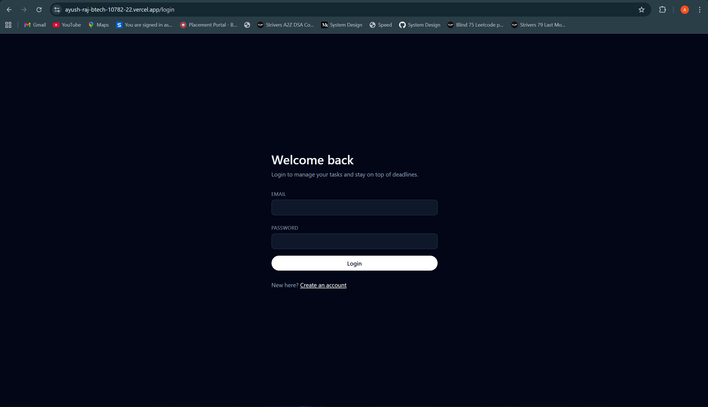
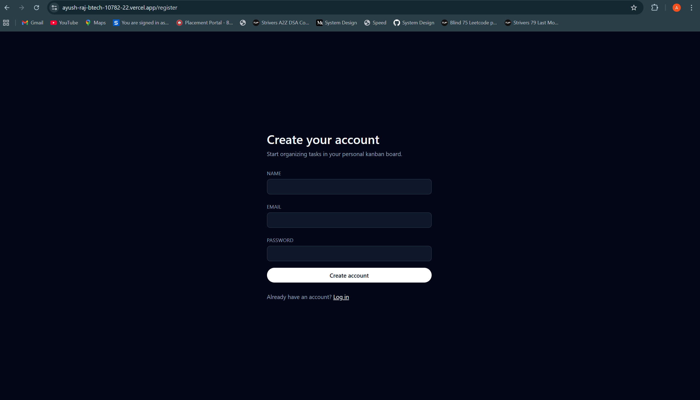
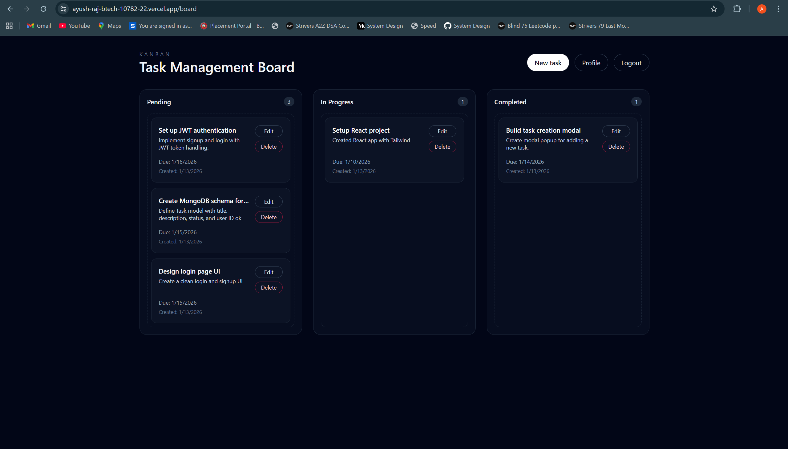
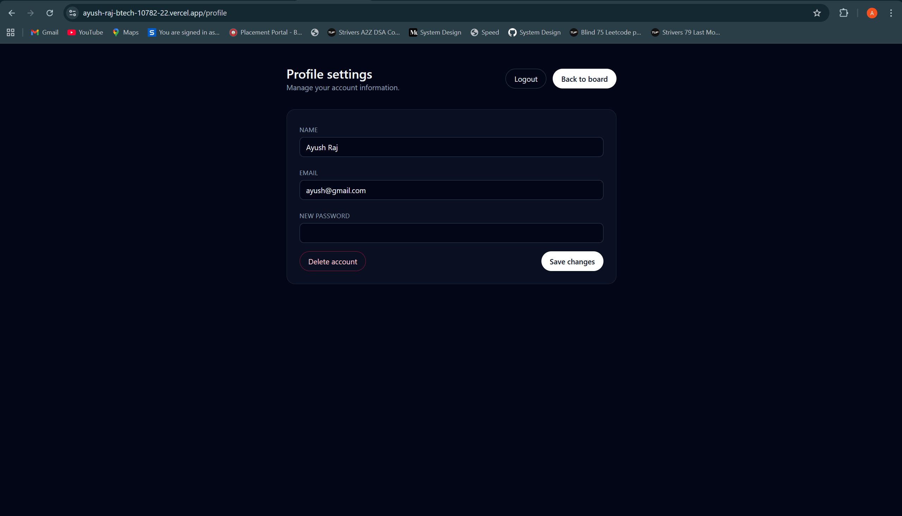

# Task Management System (Kanban Based)

## Project Overview
This is a full-stack task management system with authentication and a Kanban-style board. Users can register, login, manage their profile, and perform full CRUD on tasks with drag-and-drop status updates.

## Tech Stack Used
- Frontend: React (Vite), Tailwind CSS, @hello-pangea/dnd
- Backend: Node.js, Express.js
- Database: MongoDB (Mongoose)
- Auth: JWT

## Backend Setup Instructions
1. Install dependencies:
   ```bash
   cd backend
   npm install
   ```
2. Configure environment variables:
   ```bash
   cp .env.example .env
   ```
3. Start the server:
   ```bash
   npm run dev
   ```

## Frontend Setup Instructions
1. Install dependencies:
   ```bash
   cd frontend
   npm install
   ```
2. Configure environment variables:
   ```bash
   cp .env.example .env
   ```
3. Start the dev server:
   ```bash
   npm run dev
   ```

## Environment Variables Configuration
Backend (`backend/.env`):
- `PORT`
- `MONGO_URI`
- `JWT_SECRET`
- `CLIENT_ORIGIN`

Frontend (`frontend/.env`):
- `VITE_API_BASE_URL`

## API Overview
Auth:
- `POST /api/auth/register`
- `POST /api/auth/login`
- `POST /api/auth/logout` (stateless; client-side logout)

Users:
- `GET /api/users/me`
- `PUT /api/users/me`
- `DELETE /api/users/me`

Tasks:
- `POST /api/tasks`
- `GET /api/tasks?status=pending|in-progress|completed`
- `GET /api/tasks/:id`
- `PUT /api/tasks/:id`
- `DELETE /api/tasks/:id`

## Screenshots

### Login


### Signup


### Kanban Board


### Create New Task


### Profile


